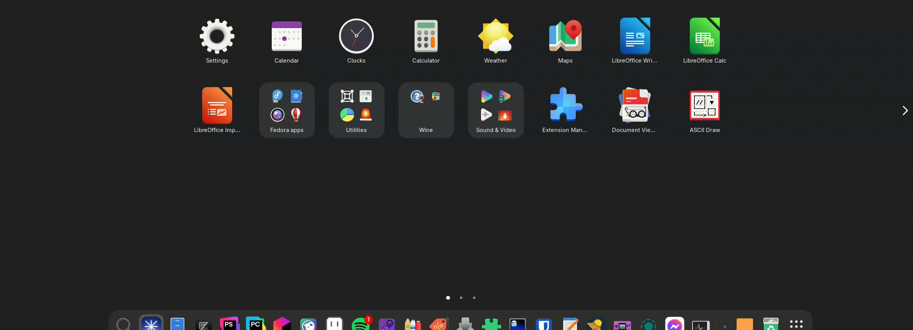
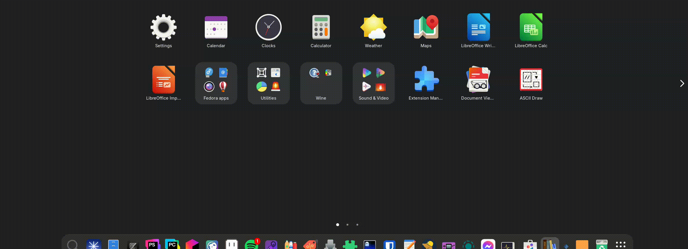

# **App Grid Page Rearrange**

A simple GNOME Shell extension that adds a context menu to the app grid page indicators (the dots) to allow you to reorder your app pages.

<!-- Badges -->
  
  
  

## **Demonstration**

    
    

## **About**

By default, GNOME Shell does not provide a way to move an entire page of applications. This extension adds a simple, right-click menu to the page indicators in the App Grid to quickly rearrange your pages without having to move every app one-by-one.

## **Features**

Right-click on the page indicators (the dots) in the App Grid to access the menu:

* **First:** Move the current page to the first position (page 1).
* **\<- (Move Left):** Swap the current page with the page to its left.
* **\-\> (Move Right):** Swap the current page with the page to its right.
* **Last:** Move the current page to the last position.

## **Compatibility**

This extension is built and tested for **GNOME 49**.

## **License**

This project is licensed under the **GPL-3.0-or-later**.
